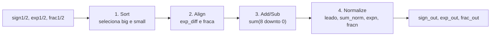
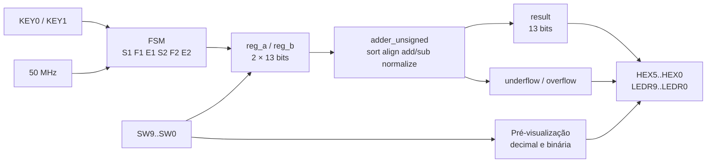
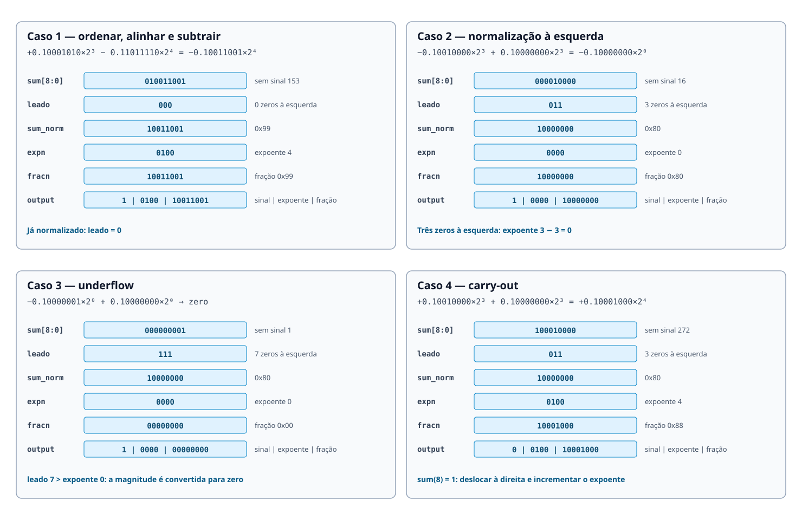
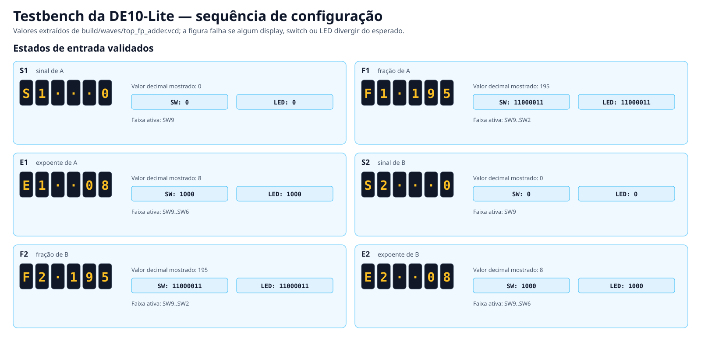
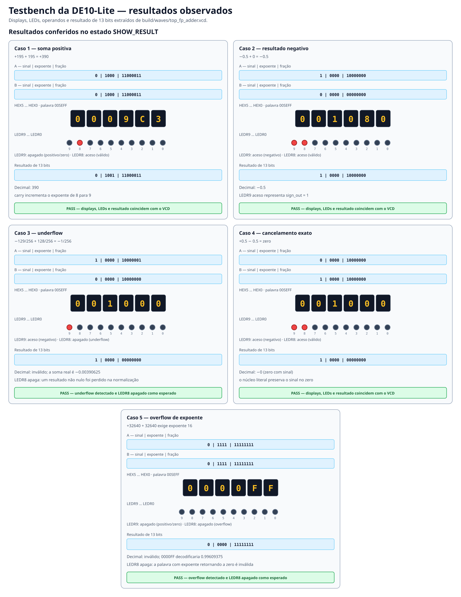

**template-somadorpf-vhdl**

# Tutorial: Implementação de Somador Ponto Flutuante na DE10-Lite

**Autores:** Guilherme Rocha Muzi Franco, Lucas Marques de Oliveira e Marconde
Correia Pinho

**Disciplina:** MCTA024 — Sistemas Digitais — Q2.2026

**Data:** [Data da entrega]

---

## 1. Objetivo do Projeto

Este projeto adapta o somador de ponto flutuante simplificado de 13 bits do
livro *FPGA Prototyping by VHDL Examples*, de Pong P. Chu, para a placa
Terasic DE10-Lite, que utiliza o FPGA MAX 10 `10M50DAF484C7G`.

O trabalho possui quatro objetivos principais:

1. compilar e validar o VHDL original do Listing 3.19;
2. observar detalhadamente o quarto estágio, responsável pela normalização;
3. adaptar entradas e saídas para os recursos físicos da DE10-Lite;
4. documentar um procedimento que possa ser reproduzido por uma pessoa
   iniciante.

Como apoio à validação, o grupo também criou scripts para automatizar a
execução dos testbenches e um conversor `encode/decode`. O `encode` transforma
um número decimal nos campos de entrada da placa; `decode` interpreta
diretamente a palavra hexadecimal de seis dígitos mostrada nos displays. O
sinal já faz parte dessa palavra e também é confirmado por `LEDR9`; a validade
é conferida por `LEDR8`.

Cada operando e o resultado possuem 13 bits:


- `sign=0`: número positivo;
- `sign=1`: número negativo;
- `exponent`: inteiro sem sinal entre 0 e 15;
- `fraction`: inteiro sem sinal de 8 bits;
- para uma entrada não nula normalizada, `fraction(7)=1`.

Assim, `fraction=195` e `exponent=8` representam `195`, e não `49920`.
O maior módulo representável é `32640`; portanto, `50000` não cabe no formato
original do livro. O procedimento completo nos dois sentidos está no
[guia de conversão](docs/CONVERSAO_NUMERICA.md).

## 2. Descrição gráfica do funcionamento do sistema

O algoritmo original possui quatro estágios combinacionais:



1. **Sort:** ordena os operandos pela magnitude `exponent & fraction`.
2. **Align:** desloca à direita a fração do menor operando.
3. **Add/Sub:** soma frações de sinais iguais ou subtrai frações de sinais
   diferentes. O vetor `sum` possui 9 bits para armazenar o carry.
4. **Normalize:** conta zeros à esquerda, desloca a fração, ajusta o expoente
   e trata underflow ou carry-out.

As entradas e a saída continuam com 13 bits. O nono bit de `sum` é somente um
intermediário; não existe uma saída de 25 bits na versão final.

### Resultado da validação do quarto estágio

O contador e o deslocamento funcionam para os quatro casos solicitados. A
análise também encontrou duas limitações no Listing 3.19:

- `leado=7` representa tanto `sum=1` quanto `sum=0`; em cancelamento exato com
  expoente alto, pode sair fração zero com expoente diferente de zero;
- um carry quando o expoente já é 15 faz `15+1` retornar para zero, pois não
  existe flag de overflow.

Esses comportamentos foram documentados e preservados no núcleo original.

---

## 3. Adaptações de Hardware (DE10-Lite)

O circuito de teste do livro não possuía entradas físicas suficientes para
dois operandos completos. A DE10-Lite possui dez switches, dois botões de uso
geral, dez LEDs e seis displays de sete segmentos.

| Arquitetura original | Adaptação para a DE10-Lite | Motivo |
|---|---|---|
| campos em portas separadas | `a`, `b` e `res` empacotados em 13 bits | reduzir a interface sem mudar a matemática |
| operandos definidos simultaneamente | estados `S1/F1/E1/S2/F2/E2` | reutilizar os dez switches |
| entradas específicas da placa antiga | `SW9..SW0`, `KEY0` e `KEY1` | usar os recursos disponíveis |
| quatro displays multiplexados | seis displays individuais | adequação à DE10-Lite |
| resultado nos campos originais | palavra hexadecimal `00SEFF` e sinal em `LEDR9` | mostrar exatamente os 13 bits, sem alterar seu valor |

**O que mudamos no VHDL original:**

- mantivemos `utils/adder.vhd` como transcrição lógica do Listing 3.19;
- criamos `adder_unsigned.vhd` com os mesmos estágios sobre dois vetores de
  entrada, uma saída de 13 bits e flags de underflow/overflow;
- criamos uma máquina de estados em `top_fp_adder.vhd`;
- roteamos switches, botões, LEDs e displays para os pinos da DE10-Lite;
- configuramos os botões como entradas `3.3 V SCHMITT TRIGGER`;
- adicionamos pré-visualização decimal e conferência binária durante a entrada.

**Descrição gráfica do sistema**



### Sequência de entrada

`KEY1` confirma o campo atual e `KEY0` retorna ao campo anterior.

| Estado | Campo | Chaves | Displays | LEDs |
|---:|---|---|---|---|
| `S1` | sinal de A | `SW9` | `S1` e `0/1` | `LEDR9` |
| `F1` | fração de A | `SW9..SW2` | `F1` e `000..255` | `LEDR9..2` |
| `E1` | expoente de A | `SW9..SW6` | `E1` e `00..15` | `LEDR9..6` |
| `S2` | sinal de B | `SW9` | `S2` e `0/1` | `LEDR9` |
| `F2` | fração de B | `SW9..SW2` | `F2` e `000..255` | `LEDR9..2` |
| `E2` | expoente de B | `SW9..SW6` | `E2` e `00..15` | `LEDR9..6` |

Na tela de resultado:

```text
HEX5 HEX4 HEX3 HEX2 HEX1 HEX0
  0    0    S     E   F[7:4] F[3:0]
```

Os 13 bits ocupam quatro dígitos (`SEFF`). Os dois zeros à esquerda apenas
estendem a palavra para os seis displays disponíveis. Por exemplo,
`1 0100 10011001` aparece como `001499`. As 8192 palavras possíveis ficam no
intervalo hexadecimal `000000..001FFF`.

- `LEDR9` apagado: `sign_out=0`;
- `LEDR9` aceso: `sign_out=1`;
- `LEDR8` aceso: resultado representável e válido;
- `LEDR8` apagado na tela de resultado: underflow ou overflow de expoente;
- `LEDR7..0`: apagados.

A disponibilidade não precisa de outro LED: ela é identificada pela troca dos
códigos `S1/F1/E1/S2/F2/E2` pela palavra hexadecimal. O detector de limites é
uma adaptação da interface e não modifica o núcleo original do livro. Um
cancelamento exato continua válido; somente um valor não nulo perdido por
underflow apaga `LEDR8`.

Diagramas, pinos e justificativas completas estão em
[Adaptação de hardware](docs/HARDWARE_DE10_LITE.md).

## 4. Evidências de Validação

### Simulação

A figura abaixo foi gerada a partir do VCD produzido pelo testbench dedicado.
Ela mostra exatamente os quatro casos solicitados para o quarto estágio.



| Caso | Operação exercitada | Saída `(sign, exponent, fraction)` |
|---:|---|---|
| 1 | ordenação, alinhamento e subtração | `(1,4,153)` |
| 2 | três deslocamentos à esquerda | `(1,0,128)` |
| 3 | underflow | `(1,0,0)` |
| 4 | carry e deslocamento à direita | `(0,4,136)` |

A interpretação matemática de cada sinal está em
[Validação dos quatro casos](docs/VALIDACAO_SIMULACAO.md).

O testbench da interface física também produz duas leituras visuais: uma para
os estados `S1/F1/E1/S2/F2/E2`, switches e LEDs, e outra para os cinco
resultados, incluindo underflow, cancelamento exato e overflow de expoente.
Os valores são extraídos diretamente do VCD; a geração é interrompida se algum
campo for diferente do esperado.





### Como reproduzir com GHDL

São necessários GHDL, GNU Make e, para visualizar as ondas, GTKWave.

```bash
make
```

O comando executa os testbenches principais e grava `.vcd` e `.ghw` em:

```text
build/waves/
```

Também é possível executar somente um conjunto:

```bash
make original       # VHDL do livro
make normalization  # quatro casos do 4º estágio
make packed         # interface empacotada de 13 bits
make board          # interface da DE10-Lite
make board-svg      # resumo visual dos displays, LEDs e resultados da placa
```

Exemplo de visualização:

```bash
gtkwave build/waves/normalization.vcd
```

### Scripts de automação e conversão

O `Makefile` automatiza a análise, elaboração e execução dos testbenches, além
de salvar as formas de onda em `build/waves/`. Também criamos
[`scripts/fp13.py`](scripts/fp13.py) para converter valores nos dois sentidos:

```bash
# Decimal para os campos que devem ser inseridos na placa.
make encode INPUT=13.25

# Leitura direta dos seis displays: 00 | sinal 1 | expoente 4 | fração 99.
make decode DISPLAY=001499 LEDR8=1
```

`DISPLAY` deve conter exatamente os seis dígitos de `HEX5..HEX0`:

```text
posição: HEX5 HEX4 HEX3 HEX2 HEX1 HEX0
formato:   0    0    S    E   F[7:4] F[3:0]
```

`S` ocupa um dígito (`0` ou `1`), `E` um dígito hexadecimal e `FF` dois
dígitos hexadecimais. `LEDR8` é opcional no comando, mas deve ser informado
para validar a soma: `1` significa resultado válido e `0` indica
underflow/overflow. Sem ele, o script decodifica os campos e marca a validade
como desconhecida.

No Makefile, `DISPLAY=...` e `LEDR8=...` são atribuições de variáveis, porque o
Make não possui argumentos posicionais para um alvo. A chamada direta ao
script usa a sintaxe convencional de linha de comando:

```bash
python3 scripts/fp13.py decode 001499 --ledr8 1
```

No exemplo de decodificação, sinal `1`, expoente hexadecimal `4` e
fração hexadecimal `99` representam `−9.5625`; `LEDR9` deve estar aceso como
conferência do sinal. Os testes automáticos do conversor podem ser executados
com:

```bash
make converter-test
```

### Código VHDL Final

O somador vetorial criado pelo grupo executa diretamente os mesmos estágios do
Listing 3.19 sobre `a` e `b`. A regressão compara seu resultado de 13 bits com
o núcleo original; as duas flags adicionais não alteram `res`.

```vhdl
a, b      : in  unsigned(12 downto 0);
res       : out unsigned(12 downto 0);
underflow : out std_logic;
overflow  : out std_logic;

sum <= ('0' & fraction_of(big)) + ('0' & aligned)
       when sign_of(big) = sign_of(small) else
       ('0' & fraction_of(big)) - ('0' & aligned);
```

Na interface física, os trechos `[DE10-LITE ADAPTATION]` identificam a FSM,
os botões, a captura das chaves e a apresentação dos resultados. Consulte os
arquivos completos:

- [`utils/adder.vhd`](utils/adder.vhd);
- [`adder_unsigned.vhd`](adder_unsigned.vhd);
- [`top_fp_adder.vhd`](top_fp_adder.vhd);
- [`utils/normalization_testbench.vhd`](utils/normalization_testbench.vhd).

---

### Funcionamento na Placa

O projeto do Quartus seleciona a família MAX 10 e o dispositivo
`10M50DAF484C7G`. Depois da compilação, o arquivo
`output_files/top_fp_adder.sof` deve ser enviado à placa pelo Programmer.

Os quatro casos mínimos e um teste adicional de overflow para `LEDR8` são:

| Caso | A `(s,e,f)` | B `(s,e,f)` | Displays | `LEDR9` | `LEDR8` |
|---:|---|---|---|---:|---:|
| 1 | `(0,3,138)` | `(1,4,222)` | `001499` | aceso | aceso |
| 2 | `(1,3,144)` | `(0,3,128)` | `001080` | aceso | aceso |
| 3 | `(1,0,129)` | `(0,0,128)` | `001000` | aceso | **apagado** |
| 4 | `(0,3,144)` | `(0,3,128)` | `000488` | apagado | aceso |
| 5 (overflow) | `(0,15,255)` | `(0,15,255)` | `0000FF` | apagado | **apagado** |

> **Evidência pendente:** inserir aqui as cinco fotos reais da DE10-Lite e
> as capturas de compilação, Pin Planner, timing e Programmer. Não foram
> criadas imagens fictícias da placa.

O roteiro físico e os nomes sugeridos para as evidências estão em
[`docs/evidence/README.md`](docs/evidence/README.md).

---

## 5. Diário de Bordo de IA

Utilizamos o **Codex, da OpenAI**, para revisar a representação numérica,
comparar o código com o Listing 3.19, elaborar testbenches, adaptar a interface
da DE10-Lite e organizar a documentação. Todas as sugestões foram conferidas
pelos testbenches e formas de onda do GHDL. A síntese no Quartus e os testes
físicos na placa devem ser registrados pelo grupo.

**Prompts técnicos selecionados:**

Os textos abaixo consolidam os objetivos enviados à IA, com terminologia e
ortografia normalizadas. A conversa original permanece disponível para
auditoria.

> “Compare a implementação com o Listing 3.19 e mantenha o formato
> `(-1)^s × 0.f × 2^e`, com entradas e saída de 13 bits.”

> “Valide o quarto estágio com casos autochecking de normalização à esquerda,
> underflow, carry e alinhamento seguido de subtração.”

> “Use a implementação vetorial de `adder_unsigned`, mantenha a saída em 13
> bits, exponha underflow/overflow e comprove equivalência com o núcleo
> original.”

> “Adapte a interface para `S1/F1/E1/S2/F2/E2`, expondo em LEDs e displays os
> campos realmente utilizados pela placa.”

> “Automatize os testbenches, armazene VCD/GHW e implemente `encode/decode`
> entre decimal e os campos de entrada e saída, incluindo a leitura
> hexadecimal empacotada `00SEFF` mostrada pela placa, considerando também a
> validade indicada por `LEDR8`.”

**O Erro da IA (Alucinação):**

> A primeira interpretação tratou os campos como `k × 2^e`, criou uma soma
> interna de 25 bits e considerou `50000` representável aproximadamente. Isso
> não correspondia à definição do livro, que usa `0.f × 2^e`.

**A Correção Humana:**

> O grupo forneceu o trecho original do livro e decidiu manter fidelidade ao
> Listing 3.19. A soma de 25 bits foi removida, o somador vetorial voltou a
> produzir 13 bits e a saída física passou a apresentar a palavra empacotada,
> estendida por zeros, como `00SEFF`. A nova versão foi comparada bit a bit com
> o núcleo original.

O histórico completo, incluindo sugestões aceitas, rejeitadas e limitações,
está no [Diário de IA](docs/AI_AUDIT.md).

## 6. Contribuição dos participantes

As atividades foram classificadas segundo a Taxonomia CRediT:

- **Guilherme Rocha Muzi Franco — Algoritmo, Simulação e Desenvolvimento
  VHDL:** Conceptualization, Methodology, Formal analysis, Investigation,
  Software, Validation e Visualization. Criou `adder_unsigned.vhd` e
  desenvolveu `top_fp_adder.vhd` com Lucas. Também criou o Makefile de
  automação dos testbenches e os scripts de `encode/decode` e testes das
  conversões.
- **Lucas Marques de Oliveira — Interface da DE10-Lite e Ambiente Quartus:**
  Methodology, Software, Resources, Investigation e Validation. Desenvolveu
  `top_fp_adder.vhd` com Guilherme e configurou o ambiente Quartus.
- **Marconde Correia Pinho — Documentação e Auditoria da IA:** Data curation,
  Writing – original draft e Writing – review & editing.

A justificativa de cada papel e a matriz consolidada estão no
[documento CRediT](docs/CREDIT.md).

Como contribuição adicional, Guilherme produziu o `Makefile` de automação dos
testbenches e os scripts de `encode/decode` usados para preparar entradas e
interpretar em decimal a saída da DE10-Lite.

Antes da entrega, use o [checklist da rubrica](docs/RUBRICA_CHECKLIST.md) e o
[tutorial detalhado](docs/TUTORIAL.md).
