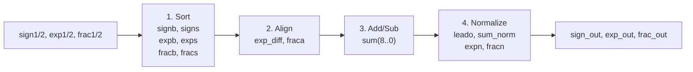
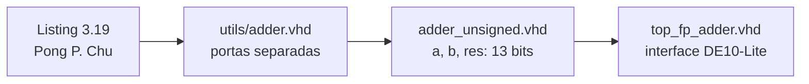
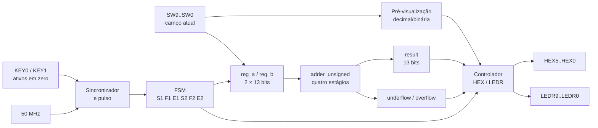

**template-somadorpf-vhdl**

# Somador de ponto flutuante de 13 bits na DE10-Lite

**Autores:** Guilherme Rocha Muzi Franco, Lucas Marques de Oliveira e Marconde
Correia Pinho

**Disciplina:** MCTA024 — Sistemas Digitais — Q2.2026

**Data de entrega:** 07/08/2026

## 1. Objetivo do projeto

O projeto valida e adapta o somador simplificado apresentado por **Pong P.
Chu** na Seção 3.7.4, *Simplified floating-point adder*, Listing 3.19 do livro
*FPGA Prototyping by VHDL Examples*. O algoritmo e sua organização em quatro
estágios são de autoria de Pong P. Chu; a contribuição do grupo é sua
validação, reescrita vetorial, adaptação para a DE10-Lite e documentação.

O alvo físico é a placa Terasic DE10-Lite, dispositivo MAX 10
`10M50DAF484C7G`.

### Formato definido pelo livro

Cada operando e o resultado possuem 13 bits:

```text
bit 12       bits 11..8       bits 7..0
sign (S)     exponent (E)     fraction (F)
```

```text
value = (-1)^S × (F/256) × 2^E
```

- `S=0`: positivo; `S=1`: negativo;
- `E`: inteiro sem sinal de 0 a 15;
- `F`: inteiro sem sinal de 0 a 255;
- uma entrada não nula normalizada exige `128 ≤ F ≤ 255`.

O modelo assume que:

- expoente e fração são campos sem sinal;
- a representação é normalizada ou zero;
- o bit mais significativo de `F` deve ser `1` em todo número não nulo;
- resultados menores que `0.10000000₂ × 2^0` são convertidos para zero;
- o arredondamento é ignorado, portanto bits deslocados para fora são
  descartados durante alinhamento e normalização.

Assim, a menor magnitude normalizada é `0.5` e a maior é `32640`. O número
`50000` não é representável. `F=195, E=8` representa `195`, pois
`(195/256)×2^8=195`; não representa `195×2^8`.

O cálculo completo está em [Conversão numérica](docs/CONVERSAO_NUMERICA.md).

## 2. Descrição gráfica do funcionamento do sistema



1. **Sort:** seleciona as maiores magnitude e expoente.
2. **Align:** desloca a fração menor para igualar os expoentes.
3. **Add/Sub:** soma sinais iguais ou subtrai sinais diferentes.
4. **Normalize:** trata zeros à esquerda, carry e underflow.

O nono bit da soma é apenas o carry intermediário. A entrada e a saída
continuam com 13 bits; não existe resultado externo de 25 bits.

Na normalização, `leado` funciona como um codificador de prioridade: conta os
zeros antes do primeiro `1`, `sum_norm` desloca a fração para a esquerda e
`expn` reduz o expoente. Se `sum(8)=1`, a fração é deslocada à direita e o
expoente aumenta. Se não houver expoente suficiente para normalizar, a
magnitude vira zero.

### Quatro casos obrigatórios


| Caso | Ramo exercitado | Saída `(S,E,F)` | Decimal |
|---:|---|---|---:|
| 1 | alinhamento e subtração | `(1,4,153)` | `−9.5625` |
| 2 | três shifts à esquerda | `(1,0,128)` | `−0.5` |
| 3 | underflow | `(1,0,0)` inválida | `−0` |
| 4 | carry e shift à direita | `(0,4,136)` | `8.5` |

A derivação de cada caso está em
[Validação da simulação](docs/VALIDACAO_SIMULACAO.md).

### O que mantivemos e o que mudamos no VHDL original



| Arquivo | Responsabilidade |
|---|---|
| `utils/adder.vhd` | transcrição compilável da lógica original para validar os quatro estágios |
| `adder_unsigned.vhd` | implementação vetorial criada pelo grupo, compatível com o resultado do Listing |
| `top_fp_adder.vhd` | captura de chaves, FSM, botões, LEDs e displays da DE10-Lite |

**O que foi mantido:**

- formato `S|E|F` e saída de 13 bits;
- comparação por `E & F`, alinhamento da menor fração e descarte de bits;
- soma/subtração em sinal-magnitude com carry interno de 9 bits;
- contador de zeros e prioridade dos ramos de normalização;
- comportamento literal de `res`, comprovado pela regressão.

**O que foi alterado ou acrescentado:**

- as seis portas de entrada e três de saída foram empacotadas em `a`, `b` e
  `res`, reduzindo a interface sem mudar os campos;
- foram expostas flags `underflow` e `overflow`; elas alimentam `LEDR8`, mas
  não modificam `res`;
- foi criada uma FSM para configurar todos os 26 bits com dez switches;
- botões ativos em zero foram sincronizados e convertidos em um pulso;
- foram adicionados pré-visualização decimal, espelhamento binário nos LEDs,
  saída hexadecimal `00SEFF`, pinout e restrição do clock de 50 MHz;
- foram criados testbenches autochecking, regressão, conversores e geração de
  evidências a partir do VCD.

A regressão compara o núcleo vetorial com o código do livro em 131072 pares de
entrada. As flags são verificadas separadamente porque não existem no Listing
3.19.

## 3. Adaptação para a DE10-Lite

### Descrição gráfica da interface física



O Listing 3.20 do livro foi escrito para uma placa com um banco de oito
switches, quatro botões e quatro displays multiplexados. Por falta de entradas,
ele fixa um operando e duplica sinais para o outro. Na DE10-Lite, o grupo decidiu
permitir que **os dois operandos completos** sejam configurados.

| Circuito de teste do livro | Adaptação DE10-Lite | Justificativa |
|---|---|---|
| um operando constante | dois registradores configuráveis | testar qualquer par de entradas |
| sinais duplicados nos switches | seis campos armazenados pela FSM | usar dez switches para 26 bits |
| quatro displays multiplexados | seis displays independentes | aproveitar o hardware disponível |
| sinal como barra no display | sinal em `HEX3` e `LEDR9` | expor diretamente o bit `S` |
| sem validade de faixa | `LEDR8=result_valid` | distinguir saída válida de underflow/overflow |

| Necessidade | Solução |
|---|---|
| configurar 26 bits com 10 switches | capturar `S1/F1/E1/S2/F2/E2` em sequência |
| conferir o dado inserido | valor decimal nos displays e bits correspondentes nos LEDs |
| preservar o núcleo de 13 bits | usar `a`, `b` e `res` empacotados |
| indicar perda de faixa | `underflow`, `overflow` e `LEDR8` |

`KEY1` confirma o campo; `KEY0` retorna ao anterior.

| Estado | Campo | Chaves | Pré-visualização |
|---|---|---|---|
| `S1`, `S2` | sinal | `SW9` | `0` ou `1` |
| `F1`, `F2` | fração | `SW9..SW2` | `000..255` |
| `E1`, `E2` | expoente | `SW9..SW6` | `00..15` |

No resultado, os seis displays mostram a palavra de 13 bits estendida com
zeros:

```text
HEX5 HEX4 HEX3 HEX2 HEX1 HEX0
  0    0    S    E   F[7:4] F[3:0]
```

- `LEDR9`: sinal (`0` positivo, `1` negativo);
- `LEDR8`: resultado válido; apaga em underflow ou overflow;
- `LEDR7..0`: apagados.

Exemplo: `1|0100|10011001` aparece como `001499`, com `LEDR9=1` e
`LEDR8=1`. Detalhes e pinout: [Hardware da DE10-Lite](docs/HARDWARE_DE10_LITE.md).

## 4. Validação e execução

### GHDL e GTKWave

```bash
make                 # quatro testbenches principais
make regression      # 131072 comparações com o núcleo original
make converter-test  # testes de encode/decode/result
make board-svg       # gera os dois painéis da interface física
gtkwave build/waves/normalization.vcd
```


### Do repositório para a FPGA

Os arquivos do Quartus já estão prontos na raiz. Portanto, a opção correta é
**abrir o projeto existente**, não criar outro:

```text
top_fp_adder.qpf   top_fp_adder.qsf   top_fp_adder.sdc
adder_unsigned.vhd   hex_to_sseg.vhd   top_fp_adder.vhd
```

Mantenha os seis na mesma pasta. Testbenches, `utils/`, `baseline/`, scripts e
documentos não precisam ser adicionados à síntese.

1. Instale o Quartus com suporte à família **MAX 10** e o driver USB-Blaster.
2. Abra **File → Open Project** e selecione `top_fp_adder.qpf`.
3. Confira **Assignments → Settings → General**:
   `top_fp_adder` e `10M50DAF484C7G`.
4. Confira **Assignments → Settings → Files**: `adder_unsigned.vhd`,
   `hex_to_sseg.vhd`, `top_fp_adder.vhd` e `top_fp_adder.sdc`.
5. Abra **Assignments → Pin Planner**. As atribuições de `top_fp_adder.qsf`
   devem aparecer automaticamente.
6. Execute **Processing → Start Compilation** e corrija qualquer erro.
7. Confirme a geração de `output_files/top_fp_adder.sof`.
8. Conecte e ligue a placa. Abra **Tools → Programmer**, escolha
   **USB-Blaster** em **Hardware Setup** e mantenha o modo **JTAG**.
9. Adicione o `.sof`, marque **Program/Configure** e clique em **Start**.
10. Com a barra em `100% (Successful)`, configure os dois operandos pelas
    chaves e confirme cada campo com `KEY1`.

O `.sof` é volátil: deve ser enviado novamente depois que a placa for
desligada. O procedimento detalhado, inclusive erros comuns, está no
[Tutorial reproduzível](docs/TUTORIAL.md). Ele também explica como copiar os
arquivos para uma pasta independente ou recriar o projeto pelo New Project
Wizard, caso isso seja realmente necessário.

### Casos para testar na placa

| Caso | A `(S,E,F)` | B `(S,E,F)` | Displays | `LEDR9` | `LEDR8` |
|---:|---|---|---|---:|---:|
| 1 | `(0,3,138)` | `(1,4,222)` | `001499` | 1 | 1 |
| 2 | `(1,3,144)` | `(0,3,128)` | `001080` | 1 | 1 |
| 3 | `(1,0,129)` | `(0,0,128)` | `001000` | 1 | 0 |
| 4 | `(0,3,144)` | `(0,3,128)` | `000488` | 0 | 1 |
| 5 | `(0,15,255)` | `(0,15,255)` | `0000FF` | 0 | 0 |

As capturas do Quartus e as fotos desses testes ainda devem ser produzidas na
ferramenta e na placa reais. Veja [Evidências](docs/evidence/README.md).

### Conversores

```bash
make encode INPUT=13.25
make decode DISPLAY=001499 LEDR8=1
make result A=5000 B=1000
```

O primeiro comando prepara `S`, `E` e `F`; o segundo converte a saída física
`00SEFF` para decimal. O terceiro reproduz codificação, alinhamento, soma e
normalização, mostrando a resolução e os erros até o resultado da placa.

## 5. Uso de inteligência artificial

O Codex foi usado para revisão matemática, testbenches, interface, automação e
documentação. Uma interpretação inicial `F×2^E` e uma soma de 25 bits foram
rejeitadas após comparação com o livro, que define `(F/256)×2^E`. Todas as
sugestões adotadas foram verificadas por cálculo, `assert` ou regressão.

O registro técnico está em [Auditoria de IA](docs/AI_AUDIT.md). A síntese no
Quartus e os testes físicos continuam sob responsabilidade do grupo.

## 6. Contribuições

## Contribuições — Taxonomia CRediT

| Integrante                      | Papéis CRediT                                                                                       | Principais contribuições                                                                                                               |
| ------------------------------- | --------------------------------------------------------------------------------------------------- | -------------------------------------------------------------------------------------------------------------------------------------- |
| **Guilherme Rocha Muzi Franco** | Conceptualization; Methodology; Formal analysis; Investigation; Software; Validation; Visualization | Desenvolvimento do algoritmo, simulação, `adder_unsigned`, automação, conversores e análise dos resultados.                            |
| **Lucas Marques de Oliveira**   | Methodology; Investigation; Software; Resources; Validation                                         | Desenvolvimento do `top_fp_adder`, configuração e utilização dos recursos da DE10-Lite, ambiente Quartus e validação da implementação. |
| **Marconde Correia Pinho**      | Data curation; Writing – original draft; Writing – review & editing                                 | Documentação do projeto, organização e curadoria das evidências, elaboração do material explicativo e auditoria do uso de IA.          |

As contribuições foram classificadas de acordo com a **Taxonomia CRediT (Contributor Roles Taxonomy)**, considerando as atividades efetivamente realizadas por cada integrante. Os papéis indicados representam as responsabilidades específicas assumidas durante o desenvolvimento, documentação e validação do projeto.


Papéis completos: [Taxonomia CRediT](docs/CREDIT.md).
Pendências de entrega: [Checklist da rubrica](docs/RUBRICA_CHECKLIST.md).

## Referência do algoritmo original

Pong P. Chu, *FPGA Prototyping by VHDL Examples*, Seção 3.7.4,
“Simplified floating-point adder”, Listing 3.19; circuito de teste no Listing
3.20. O código deste repositório é uma adaptação acadêmica dessa arquitetura
para a Terasic DE10-Lite.
