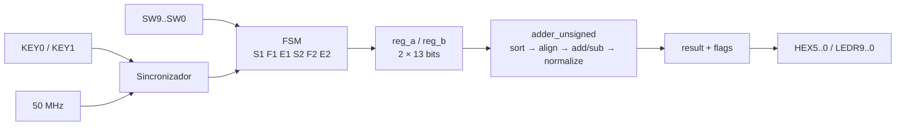
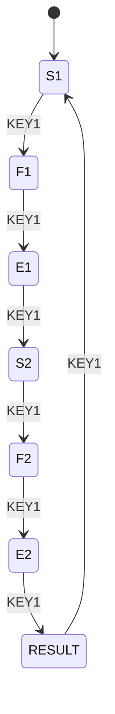

# Adaptação de hardware — DE10-Lite

## Arquitetura



O somador original possuía portas separadas. `adder_unsigned.vhd` aplica o
mesmo algoritmo diretamente a dois vetores de 13 bits e produz `res`,
`underflow` e `overflow`. `top_fp_adder.vhd` cuida apenas da interface física.

| Limitação/adaptação | Implementação | Motivo |
|---|---|---|
| 26 bits de entrada, 10 switches | FSM de seis estados | reutilizar as chaves |
| botões assíncronos e ativos em zero | sincronização e detecção de borda | um avanço por acionamento |
| conferência da entrada | decimal nos HEX e binário nos LEDs | detectar erro de digitação |
| seis displays | saída hexadecimal `00SEFF` | mostrar os 13 bits sem reinterpretá-los |
| expoente limitado | `LEDR8=result_valid` | sinalizar underflow/overflow |

## Máquina de estados



`KEY0` retorna ao estado anterior. Todos os campos começam em `SW9`:

| Estado | Destino | Chaves | LEDs | Displays |
|---|---|---|---|---|
| `S1/S2` | bit 12 | `SW9` | `LEDR9` | `0/1` |
| `F1/F2` | bits 7..0 | `SW9..SW2` | `LEDR9..2` | `000..255` |
| `E1/E2` | bits 11..8 | `SW9..SW6` | `LEDR9..6` | `00..15` |

Os LEDs fora do campo atual ficam apagados. Uma fração normalizada não nula
possui `SW9=1`, pois `F(7)=1`.

## Resultado físico

```text
HEX5 HEX4 HEX3 HEX2 HEX1 HEX0
  0    0    S    E   F[7:4] F[3:0]
```

| Saída | Significado |
|---|---|
| `HEX5..HEX4` | zeros de extensão |
| `HEX3` | sinal `S` (`0` ou `1`) |
| `HEX2` | expoente hexadecimal `E` |
| `HEX1..HEX0` | fração hexadecimal `FF` |
| `LEDR9` | sinal; apagado positivo, aceso negativo |
| `LEDR8` | aceso válido; apagado underflow/overflow |
| `LEDR7..0` | apagados |

Exemplo: `result=1|0100|10011001` produz `001499`, `LEDR9=1` e
`LEDR8=1`. Um cancelamento exato mantém validade; somente a perda de um valor
não nulo por underflow ou um carry para expoente 16 apaga `LEDR8`.

## Pinout utilizado

O arquivo executável e fonte de verdade é `top_fp_adder.qsf`.

### Clock e botões

| Porta | Recurso | Pino | Padrão elétrico |
|---|---|---|---|
| `clk` | `MAX10_CLK1_50` | `P11` | 3.3-V LVTTL |
| `bt_clear` | `KEY0` | `B8` | 3.3 V Schmitt Trigger |
| `bt_adv` | `KEY1` | `A7` | 3.3 V Schmitt Trigger |

### Switches e LEDs

| Índice | `sw` | `ledr` |
|---:|---:|---:|
| 0 | `C10` | `A8` |
| 1 | `C11` | `A9` |
| 2 | `D12` | `A10` |
| 3 | `C12` | `B10` |
| 4 | `A12` | `D13` |
| 5 | `B12` | `C13` |
| 6 | `A13` | `E14` |
| 7 | `A14` | `D14` |
| 8 | `B14` | `A11` |
| 9 | `F15` | `B11` |

### Displays

Os segmentos são ativos em zero e seguem `hexN(7..0)=[dp g f e d c b a]`.

| Display | Pinos `hexN[0]` até `hexN[7]` |
|---|---|
| `HEX0` | `C14 E15 C15 C16 E16 D17 C17 D15` |
| `HEX1` | `C18 D18 E18 B16 A17 A18 B17 A16` |
| `HEX2` | `B20 A20 B19 A21 B21 C22 B22 A19` |
| `HEX3` | `F21 E22 E21 C19 C20 D19 E17 D22` |
| `HEX4` | `F18 E20 E19 J18 H19 F19 F20 F17` |
| `HEX5` | `J20 K20 L18 N18 M20 N19 N20 L19` |

## Integração no Quartus

`top_fp_adder.qsf` já seleciona:

```text
Family: MAX 10
Device: 10M50DAF484C7G
Top-level: top_fp_adder
Sources: adder_unsigned.vhd, hex_to_sseg.vhd, top_fp_adder.vhd
Constraint: top_fp_adder.sdc, clk=50 MHz (20 ns)
```

Esses três arquivos de projeto e os três VHDL ficam juntos na raiz. A raiz do
repositório já é a pasta de trabalho do Quartus: abra `top_fp_adder.qpf` e não
crie outro projeto. Diretórios como `db/`, `incremental_db/` e `output_files/`
são gerados automaticamente e não devem ser copiados como fontes.

Se for obrigatório criar do zero, copie os três VHDL e o SDC para a nova pasta,
use o New Project Wizard e importe o QSF original por **Assignments → Import
Assignments** para recuperar pinos e padrões elétricos. O procedimento completo
está em [TUTORIAL.md](TUTORIAL.md).

## Casos físicos

| Caso | A `(S,E,F)` | B `(S,E,F)` | `00SEFF` | `LEDR8` | Ramo |
|---:|---|---|---|---:|---|
| 1 | `(0,3,138)` | `(1,4,222)` | `001499` | 1 | align/subtract |
| 2 | `(1,3,144)` | `(0,3,128)` | `001080` | 1 | shift esquerdo |
| 3 | `(1,0,129)` | `(0,0,128)` | `001000` | 0 | underflow |
| 4 | `(0,3,144)` | `(0,3,128)` | `000488` | 1 | carry |
| 5 | `(0,15,255)` | `(0,15,255)` | `0000FF` | 0 | overflow |
