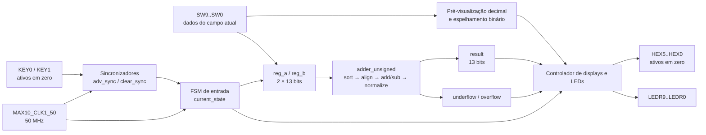
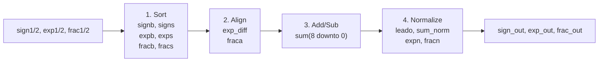
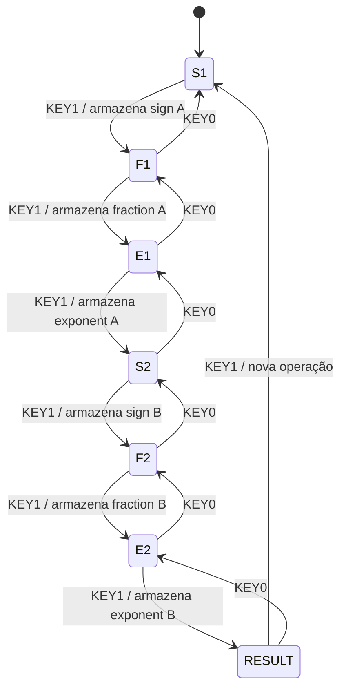

# Adaptação de hardware para a DE10-Lite

Este documento relaciona cada adaptação física com os sinais VHDL e explica
por que ela foi necessária.

## 1. Diagrama de blocos completo



O bloco `adder_unsigned`, criado pelo grupo, aplica diretamente aos vetores
`reg_a/reg_b` os mesmos quatro estágios do Listing 3.19. Sua saída `res`
continua tendo 13 bits; `underflow` e `overflow` são apenas sinais de estado.
Uma regressão compara `res` com `fp_adder` para impedir divergências.

## 2. Arquitetura matemática original



Essa estrutura corresponde diretamente aos sinais de `utils/adder.vhd` e aos
sinais mostrados no GTKWave.

## 3. Máquina de estados da entrada



São necessários 26 bits para apresentar simultaneamente os dois operandos, mas
a placa possui dez switches. A FSM resolve essa limitação capturando os seis
campos em sequência.

## 4. Comparação entre o exemplo original e a DE10-Lite

| Aspecto | Circuito de teste do livro | Adaptação DE10-Lite | Motivo |
|---|---|---|---|
| Entradas do somador | campos em portas separadas | dois registradores empacotados de 13 bits | reduzir conexões e armazenar os operandos |
| Entrada física | constantes e sinais duplicados | seis etapas usando `SW9..SW0` | permitir qualquer operando com apenas dez switches |
| Confirmação | dependente da placa original | `KEY1` avança e `KEY0` retorna | interface adequada aos dois botões disponíveis |
| Clock | genérico | `MAX10_CLK1_50`, 50 MHz | sincronizar botões e FSM |
| Displays | quatro dígitos multiplexados no exemplo | seis displays individuais `HEX5..HEX0` | recursos físicos da DE10-Lite |
| LEDs | não usados para todos os campos | espelham os switches ativos | conferir a entrada binária |
| Resultado | sinal, expoente e fração | palavra hexadecimal `00SEFF` e sinal em `LEDR9` | mostrar exatamente os 13 bits produzidos |
| Tecnologia | arquitetura genérica/antiga | MAX 10 `10M50DAF484C7G` | dispositivo efetivamente disponível |

## 5. Trechos VHDL que evidenciam a adaptação

Na Etapa 2, o algoritmo foi escrito sobre os vetores empacotados, mantendo os
mesmos estágios e acrescentando duas saídas de estado:

```vhdl
-- adder_unsigned.vhd
a, b : in  unsigned(12 downto 0);
res  : out unsigned(12 downto 0);
underflow, overflow : out std_logic;
```

O `top_fp_adder` apenas conecta essas flags. Assim, a interface física não
repete ordenação, alinhamento ou normalização.

A segunda mudança pertence somente à interface física. Ela captura cada campo
no registrador correspondente:

```vhdl
-- top_fp_adder.vhd
when SET_SIG_A =>
    reg_a(7 downto 0) <= unsigned(sw(9 downto 2));
when SET_EXP_A =>
    reg_a(11 downto 8) <= unsigned(sw(9 downto 6));
```

Finalmente, a saída mantém os campos do livro visíveis sem reconstruí-los como
um inteiro:

```vhdl
disp_h4 <= std_logic_vector(result(11 downto 8));
disp_h1 <= std_logic_vector(result(7 downto 4));
disp_h0 <= std_logic_vector(result(3 downto 0));
ledr(9) <= result(12);
```

Os arquivos VHDL marcam esses blocos com comentários `[ADAPTATION]` e
`[DE10-LITE ADAPTATION]`, facilitando sua identificação no relatório.

## 6. Mapeamento dos campos nos switches

Todos os campos começam em `SW9`, facilitando a operação:

| Estado | Campo | Chaves | Pré-visualização | LEDs |
|---:|---|---|---|---|
| `S1` | `reg_a(12)` | `SW9` | `HEX0=0/1` | `LEDR9` |
| `F1` | `reg_a(7..0)` | `SW9..SW2` | `HEX2..0=000..255` | `LEDR9..2` |
| `E1` | `reg_a(11..8)` | `SW9..SW6` | `HEX1..0=00..15` | `LEDR9..6` |
| `S2` | `reg_b(12)` | `SW9` | `HEX0=0/1` | `LEDR9` |
| `F2` | `reg_b(7..0)` | `SW9..SW2` | `HEX2..0=000..255` | `LEDR9..2` |
| `E2` | `reg_b(11..8)` | `SW9..SW6` | `HEX1..0=00..15` | `LEDR9..6` |

Os LEDs fora do campo atual ficam apagados. Durante `F1/F2`, uma entrada
normalizada não nula sempre possui `SW9=1`, pois `fraction(7)=1`.

## 7. Apresentação do resultado

```text
HEX5 HEX4 HEX3 HEX2 HEX1 HEX0
  0    0    S     E   F[7:4] F[3:0]
```

| Saída | Significado |
|---|---|
| `HEX5..HEX4` | zeros de extensão para completar seis dígitos |
| `HEX3` | nibble `000 & result(12)`, portanto `0` ou `1` |
| `HEX2` | expoente hexadecimal `result(11..8)` |
| `HEX1..HEX0` | fração hexadecimal `result(7..0)` |
| `LEDR9` | `result(12)`, o bit de sinal |
| `LEDR8` | `1` em `SHOW_RESULT` somente quando não ocorreu underflow nem overflow |
| `LEDR7..0` | apagados no resultado |

Exemplo: `result = 1 0100 10011001` produz `001499`, `LEDR9=1` e
`LEDR8=1`. O valor decimal é `−9.5625`, conforme o guia de conversão. Como
13 bits exigem quatro dígitos hexadecimais, os dois primeiros zeros são apenas
extensão para utilizar os seis displays.

Na tela de resultado, `LEDR8=0` indica um dos dois limites da normalização: um
resultado não nulo exigiu deslocar a fração além do expoente disponível
(underflow), ou um carry exigiu expoente 16 (overflow). O valor hexadecimal
continua visível, mas deve ser tratado como inválido. Um cancelamento exato para
zero mantém `LEDR8=1`. Nos estados de entrada, a própria etiqueta
`S1/F1/E1/S2/F2/E2` indica que ainda não há resultado.

## 8. Pinout da DE10-Lite

### Clock e botões

| Porta VHDL | Recurso | Pino | Observação |
|---|---|---|---|
| `clk` | `MAX10_CLK1_50` | `P11` | período de 20 ns no SDC |
| `bt_clear` | `KEY0` | `B8` | ativo em zero; Schmitt trigger; retorna um estado |
| `bt_adv` | `KEY1` | `A7` | ativo em zero; Schmitt trigger; confirma um campo |

### Switches e LEDs

| Índice | `sw[index]` | `ledr[index]` |
|---:|---:|---:|
| 0 | `C10` | `A8` |
| 1 | `C11` | `A9` |
| 2 | `D12` | `A10` |
| 3 | `C12` | `B10` |
| 4 | `A12` | `D13` |
| 5 | `B12` | `C13` |
| 6 | `A13` | `E14` |
| 7 | `A14` | `D14` |
| 8 | `B14` | `A11` |
| 9 | `F15` | `B11` |

### Displays

Cada vetor usa a ordem `hexN(7..0)=[dp g f e d c b a]`, com segmentos ativos
em zero.

| Display | Pinos de `hexN[0]` até `hexN[7]` |
|---:|---|
| `HEX0` | `C14, E15, C15, C16, E16, D17, C17, D15` |
| `HEX1` | `C18, D18, E18, B16, A17, A18, B17, A16` |
| `HEX2` | `B20, A20, B19, A21, B21, C22, B22, A19` |
| `HEX3` | `F21, E22, E21, C19, C20, D19, E17, D22` |
| `HEX4` | `F18, E20, E19, J18, H19, F19, F20, F17` |
| `HEX5` | `J20, K20, L18, N18, M20, N19, N20, L19` |

Clock, switches, LEDs e displays usam `3.3-V LVTTL`. Os dois botões usam
`3.3 V SCHMITT TRIGGER`, conforme o projeto padrão da placa. O arquivo
executável da atribuição é `top_fp_adder.qsf`; esta tabela deve permanecer
consistente com ele.

O pinout foi conferido com os recursos oficiais da
[DE10-Lite da Terasic](https://www.terasic.com.tw/cgi-bin/page/archive.pl?Language=English&No=1021&PartNo=4),
que disponibilizam o manual e o projeto de referência da placa.

## 9. Exemplo completo de operação física

Caso 1 do livro:

| Etapa | Valor decimal exibido | Padrão nas chaves principais |
|---:|---:|---|
| `S1` | `0` | `SW9=0` |
| `F1` | `138` | `SW9..2=10001010` |
| `E1` | `03` | `SW9..6=0011` |
| `S2` | `1` | `SW9=1` |
| `F2` | `222` | `SW9..2=11011110` |
| `E2` | `04` | `SW9..6=0100` |

Depois da sexta confirmação:

```text
Displays: 001499
LEDR9: aceso (negativo)
LEDR8: aceso (resultado válido)
Valor decimal: −9.5625
```

## 10. Plano mínimo de testes físicos

| Caso | A `(s,e,f)` | B `(s,e,f)` | Displays | `LEDR9` | `LEDR8` | Interpretação |
|---:|---|---|---|---:|---:|---|
| 1 | `(0,3,138)` | `(1,4,222)` | `001499` | 1 | 1 | sort/align/subtract |
| 2 | `(1,3,144)` | `(0,3,128)` | `001080` | 1 | 1 | três shifts à esquerda |
| 3 | `(1,0,129)` | `(0,0,128)` | `001000` | 1 | 0 | underflow: resultado exato −1/256 não representável |
| 4 | `(0,3,144)` | `(0,3,128)` | `000488` | 0 | 1 | carry e shift à direita |
| 5 | `(0,15,255)` | `(0,15,255)` | `0000FF` | 0 | 0 | overflow: expoente 16 não representável |

Para cada caso, registre uma foto da entrada binária nos LEDs, uma foto do
resultado e a conversão decimal correspondente. Não declare validação física
antes de executar esses testes na placa.
